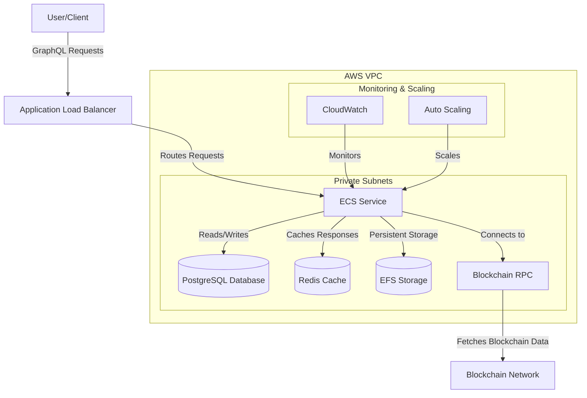
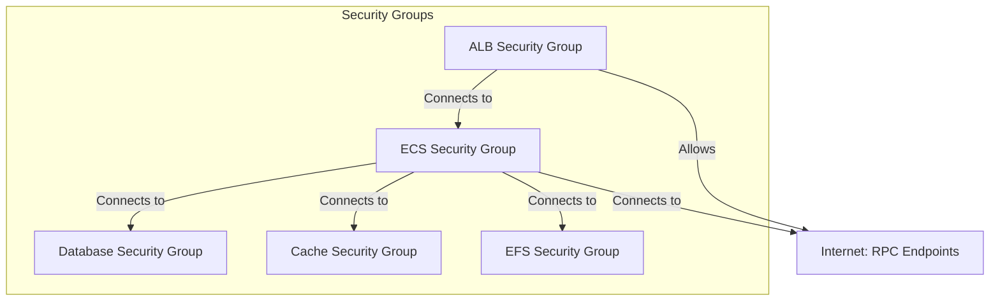

# Subsquid Infrastructure Module

This Terraform module deploys a production-ready Subsquid indexing infrastructure on AWS with optimized cost and performance.

## Architecture



## Features

- **Scalable**: Auto-scaling based on CPU and memory utilization
- **Cost-optimized**: Three optimization tiers with different cost-saving strategies
- **High-performance**: Connection pooling, query caching, and compression
- **Secure**: Private subnets, security groups, and encrypted storage
- **Resilient**: Multi-AZ deployment with automatic failover
- **Monitored**: CloudWatch metrics and logs

## Usage

```hcl
module "subsquid" {
  source = "../../modules/subsquid"

  region      = "us-east-1"
  environment = "prod"
  project     = "my-project"
  vpc_id      = module.vpc.vpc_id
  subnet_ids  = module.vpc.private_subnets
  
  # Blockchain configuration
  subsquid_image     = "subsquid/eth-processor:latest"
  chain_rpc_endpoint = "https://ethereum-rpc.example.com/"
  
  # Database configuration
  database_name = "ethereum_mainnet"
  database_serverless = true
  
  # Cost optimization
  cost_optimization_level = "balanced"
  use_spot_instances = true
  
  # Performance settings
  enable_caching = true
  enable_query_caching = true
  enable_connection_pooling = true
  
  # Custom environment variables
  custom_environment_variables = {
    CHAIN_ID = "1"
    NETWORK  = "mainnet"
  }
}
```

## Cost Optimization Levels

| Level | Description | Estimated Savings |
|-------|-------------|-------------------|
| basic | Standard deployment with minimal optimizations | 60-70% |
| balanced | Moderate cost-saving measures | 85-90% |
| aggressive | Maximum cost optimization | 90-95% |

## Security Architecture



## Official Subsquid Images

You can use these official Subsquid images:

- `subsquid/node:latest` - Base image for running Subsquid nodes
- `subsquid/graphql-server:latest` - GraphQL API server component
- `subsquid/substrate-processor:latest` - For Substrate-based blockchains
- `subsquid/evm-processor:latest` - For Ethereum-based blockchains
- `subsquid/near-processor:latest` - For NEAR Protocol

## Inputs

| Name | Description | Type | Default | Required |
|------|-------------|------|---------|:--------:|
| region | AWS region | string | n/a | yes |
| environment | Environment name (e.g., dev, staging, prod) | string | n/a | yes |
| project | Project name | string | "default" | no |
| vpc_id | ID of the VPC | string | n/a | yes |
| subnet_ids | List of subnet IDs | list(string) | n/a | yes |
| subsquid_image | Docker image for Subsquid | string | n/a | yes |
| cost_optimization_level | Cost optimization level (basic, balanced, aggressive) | string | "balanced" | no |
| chain_rpc_endpoint | Blockchain RPC endpoint URL | string | "" | no |
| archive_endpoint | Subsquid Archive endpoint URL | string | "" | no |
| enable_caching | Whether to enable Redis caching | bool | false | no |
| enable_query_caching | Whether to enable GraphQL query caching | bool | false | no |
| enable_connection_pooling | Whether to enable database connection pooling | bool | false | no |
| enable_compression | Whether to enable response compression | bool | false | no |
| database_serverless | Whether to use serverless database | bool | false | no |
| use_spot_instances | Whether to use Spot instances | bool | false | no |
| use_graviton_processors | Whether to use Graviton processors | bool | false | no |
| min_capacity | Minimum number of ECS tasks | number | 1 | no |
| max_capacity | Maximum number of ECS tasks | number | 5 | no |
| log_retention_days | Number of days to retain CloudWatch logs | number | 30 | no |

## Outputs

| Name | Description |
|------|-------------|
| endpoint | Subsquid GraphQL API endpoint URL |
| prometheus_endpoint | Prometheus metrics endpoint URL |
| database_endpoint | Database endpoint |
| subsquid_endpoint | DNS endpoint for the Subsquid GraphQL API |
| cache_endpoint | Redis cache endpoint |
| ecs_cluster_name | Name of the ECS cluster |
| ecs_service_name | Name of the ECS service |
| security_group_id | ID of the security group for Subsquid services |
| effective_config | Effective configuration after applying optimization level |

## Accessing from Other Services

To allow another service to access the Subsquid GraphQL API, use the client security group:

```hcl
resource "aws_security_group_rule" "allow_from_client" {
  type                     = "ingress"
  from_port                = 4350
  to_port                  = 4350
  protocol                 = "tcp"
  source_security_group_id = module.subsquid.client_security_group_id
  security_group_id        = your_service_security_group_id
}
```

## License

MIT 