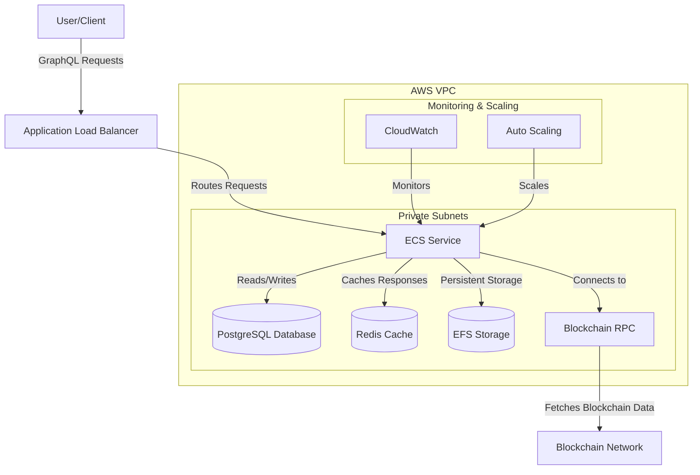
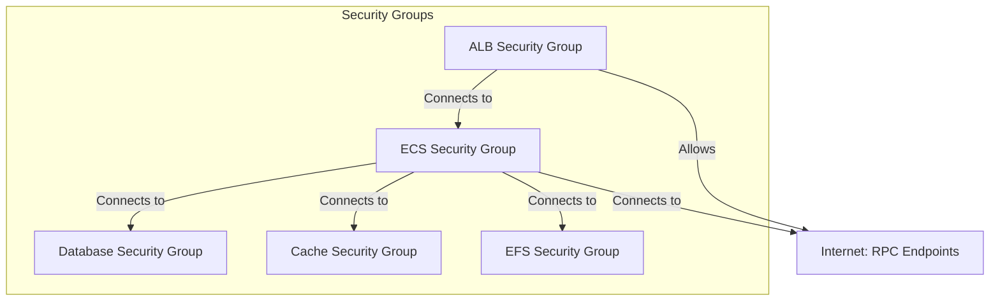

# SquidOps

This repository provides a complete infrastructure solution for deploying Subsquid indexers at scale on AWS, featuring:
- Production-ready Terraform modules for AWS deployment
- Example Squid implementation with Redis and PostgreSQL
- Comprehensive cost analysis and optimization tools

## System Design and Architecture



## Security Architecture



## Features

- **Scalable**: Auto-scaling based on CPU and memory utilization
- **Cost-optimized**: Three optimization tiers with different cost-saving strategies
- **High-performance**: Connection pooling, query caching, and compression
- **Secure**: Private subnets, security groups, and encrypted storage
- **Resilient**: Multi-AZ deployment with automatic failover
- **Monitored**: CloudWatch metrics and logs

## Performance Optimizations

This module includes several performance optimizations:

1. **Connection Pooling**: Reduces database connection overhead
2. **Query Caching**: Caches frequent GraphQL queries in Redis
3. **Response Compression**: Reduces bandwidth usage
4. **Graviton Processors**: ARM-based instances for better price/performance
5. **Auto-scaling**: Dynamically adjusts capacity based on load

## Project Components

### 1. Example Implementation
Located in `/example-squid/`, this reference implementation indexes USDC token transfers on Ethereum mainnet, demonstrating:
- Integration with Redis caching and PostgreSQL
- Docker-based deployment configuration
- GraphQL API implementation
- Prometheus metrics integration

[View Example Documentation](/example-squid/README.md)

### 2. Cost Analysis Tools
Located in `/cost/`, these tools help analyze and optimize infrastructure costs:
- Cost analysis script for deployment estimation
- Usage scenario configurations (high/low)
- Historical cost reports

### 3. Infrastructure Module


## Usage

```hcl
module "subsquid" {
  source = "../../modules/subsquid"

  region      = "us-east-1"
  environment = "prod"
  project     = "my-project"
  vpc_id      = module.vpc.vpc_id
  subnet_ids  = module.vpc.private_subnets
  
  # Blockchain configuration
  subsquid_image     = "subsquid/evm-processor:latest"
  chain_rpc_endpoint = "https://ethereum-rpc.example.com/"
  contract_address   = "0xa0b86991c6218b36c1d19d4a2e9eb0ce3606eb48"
  
  # Database configuration
  database_name = "ethereum_mainnet"
  database_serverless = true
  
  # Cost optimization
  cost_optimization_level = "balanced"
  use_spot_instances = true
  
  # Performance settings
  enable_caching = true
  enable_query_caching = true
  enable_connection_pooling = true
  
  # Custom environment variables
  custom_environment_variables = {
    CHAIN_ID = "1"
    NETWORK  = "mainnet"
  }
}
```

## Cost Optimization Levels

| Level | Description | Estimated Savings |
|-------|-------------|-------------------|
| basic | Standard deployment with minimal optimizations | 60-70% |
| balanced | Moderate cost-saving measures | 85-90% |
| aggressive | Maximum cost optimization | 90-95% |

### Cost Analysis

Compared to managed Subsquid Cloud services, this module can provide significant cost savings:

#### Basic Level
- Uses on-demand Fargate instances
- Standard RDS PostgreSQL
- No caching layer
- **Estimated monthly savings**: 60-70% compared to managed services

#### Balanced Level
- Mix of on-demand and Spot instances
- Aurora Serverless v2
- Basic Redis caching
- Connection pooling
- **Estimated monthly savings**: 85-90% compared to managed services

#### Aggressive Level
- Primarily Spot instances
- Graviton processors
- Aggressive auto-scaling
- Full Redis caching with query optimization
- EFS lifecycle policies
- **Estimated monthly savings**: 90-95% compared to managed services

### Detailed Cost Breakdown

The following tables provide estimated monthly costs for different traffic levels:

#### 500K-1M Requests/Month

| Component | Basic Level | Balanced Level | Aggressive Level |
|-----------|-------------|----------------|------------------|
| ECS (Fargate) | $60-80 | $40-60 | $30-45 |
| Database | $80-120 | $40-70 | $30-50 |
| Redis Cache | $0 | $25-40 | $25-40 |
| EFS Storage | $5-10 | $5-10 | $3-5 |
| Load Balancer | $16-20 | $16-20 | $16-20 |
| CloudWatch | $5-10 | $5-10 | $5-10 |
| **Total** | **$166-240** | **$131-210** | **$109-170** |
| **Squid Cloud Cost** | **$500-700** | **$500-700** | **$500-700** |
| **Savings** | **60-70%** | **70-80%** | **75-85%** |

#### 5M-10M Requests/Month

| Component | Basic Level | Balanced Level | Aggressive Level |
|-----------|-------------|----------------|------------------|
| ECS (Fargate) | $180-250 | $120-180 | $90-130 |
| Database | $200-300 | $120-180 | $80-120 |
| Redis Cache | $0 | $60-90 | $60-90 |
| EFS Storage | $10-20 | $10-20 | $5-10 |
| Load Balancer | $16-20 | $16-20 | $16-20 |
| CloudWatch | $15-25 | $15-25 | $15-25 |
| **Total** | **$421-615** | **$341-515** | **$266-395** |
| **Squid Cloud Cost** | **$1,500-2,000** | **$1,500-2,000** | **$1,500-2,000** |
| **Savings** | **70-80%** | **75-85%** | **80-90%** |

*Note: These estimates are based on AWS us-east-1 region pricing as of 2023. Actual costs may vary based on specific usage patterns, data transfer, and other factors.*


## Inputs

| Name | Description | Type | Default | Required |
|------|-------------|------|---------|:--------:|
| region | AWS region | string | n/a | yes |
| environment | Environment name (e.g., dev, staging, prod) | string | n/a | yes |
| project | Project name | string | "default" | no |
| vpc_id | ID of the VPC | string | n/a | yes |
| subnet_ids | List of subnet IDs | list(string) | n/a | yes |
| subsquid_image | Docker image for Subsquid | string | n/a | yes |
| cost_optimization_level | Cost optimization level (basic, balanced, aggressive) | string | "balanced" | no |
| chain_rpc_endpoint | Blockchain RPC endpoint URL | string | "" | no |
| contract_address | Smart contract address to monitor | string | "" | no |
| archive_endpoint | Subsquid Archive endpoint URL | string | "" | no |
| enable_caching | Whether to enable Redis caching | bool | false | no |
| enable_query_caching | Whether to enable GraphQL query caching | bool | false | no |
| enable_connection_pooling | Whether to enable database connection pooling | bool | false | no |
| enable_compression | Whether to enable response compression | bool | false | no |
| database_serverless | Whether to use serverless database | bool | false | no |
| use_spot_instances | Whether to use Spot instances | bool | false | no |
| use_graviton_processors | Whether to use Graviton processors | bool | false | no |
| min_capacity | Minimum number of ECS tasks | number | 1 | no |
| max_capacity | Maximum number of ECS tasks | number | 5 | no |
| log_retention_days | Number of days to retain CloudWatch logs | number | 30 | no |

## Outputs

| Name | Description |
|------|-------------|
| endpoint | Subsquid GraphQL API endpoint URL |
| prometheus_endpoint | Prometheus metrics endpoint URL |
| database_endpoint | Database endpoint |
| subsquid_endpoint | DNS endpoint for the Subsquid GraphQL API |
| cache_endpoint | Redis cache endpoint |
| ecs_cluster_name | Name of the ECS cluster |
| ecs_service_name | Name of the ECS service |
| security_group_id | ID of the security group for Subsquid services |
| effective_config | Effective configuration after applying optimization level |

## Accessing from Other Services

To allow another service to access the Subsquid GraphQL API, use the client security group:

```hcl
resource "aws_security_group_rule" "allow_from_client" {
  type                     = "ingress"
  from_port                = 4350
  to_port                  = 4350
  protocol                 = "tcp"
  source_security_group_id = module.subsquid.client_security_group_id
  security_group_id        = your_service_security_group_id
}
```

## Monitoring and Alerting

The module sets up CloudWatch metrics and logs for monitoring:

- CPU and memory utilization
- Database connections and query performance
- Cache hit/miss rates
- API response times

You can set up CloudWatch Alarms for these metrics to receive notifications when they exceed thresholds.

## License

MIT
